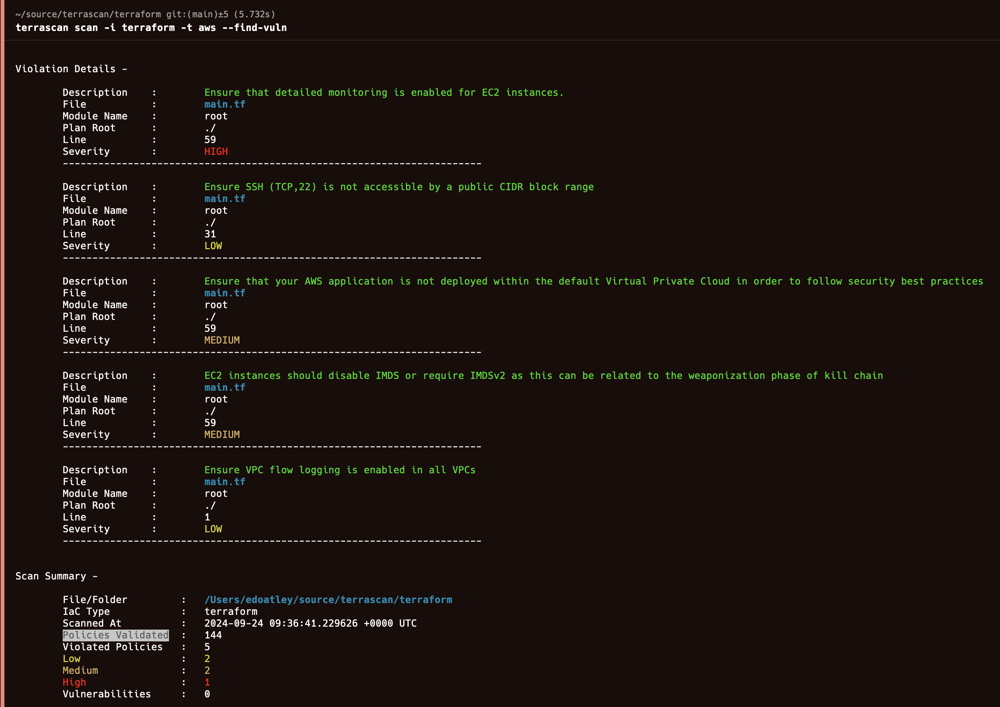

# Terrascan

## Introduction

Terraform code defines how your infrastructure will be created and as such has immense power to make it very secure or very insecure! 
I write quite a lot of terraform but nevertheless it is hard to remember everything you need to set to get the perfect deployment 
of every resource. Static analysis is a powerful tool to scan terraform code for common issues or potentially dangerous/insecure 
settings we want to prohibit or at least review. It is a powerful way to catch mistakes early and enforce standards. 

Here I take a quick look at using [terrascan](https://github.com/tenable/terrascan) to achieve to perform static analysis 
before committing my code and within a CI pipeline. 

## Setup

To try out terrascan we need to set up a terrascan and some terraform code to scan.

### 1. Install terrascan

On MacOS terrascan is most easily installed using [Homebrew](https://brew.sh/):

```bash
brew install terrascan
```

### 2. Create some terraform code to scan

Next I will write some terraform create a simple VNet with 3 subnets, an Internet Gateway, Route Table:   

```hcl
resource "aws_vpc" "main" {
  cidr_block = var.vpc_cidr_block
}

resource "aws_subnet" "subnets" {
  for_each          = var.vpc_subnets
  vpc_id            = aws_vpc.main.id
  cidr_block        = each.value.cidr_block
  availability_zone = each.value.availability_zone
}

resource "aws_internet_gateway" "igw" {
  vpc_id = aws_vpc.main.id
}

resource "aws_route_table" "rt" {
  vpc_id = aws_vpc.main.id

  route {
    cidr_block = "0.0.0.0/0"
    gateway_id = aws_internet_gateway.igw.id
  }
}

resource "aws_route_table_association" "a" {
  for_each       = aws_subnet.subnets
  subnet_id      = each.value.id
  route_table_id = aws_route_table.rt.id
}
```

Then I deploy an EC2 instance running the latest Amazon Linux with SSH from my laptop allowed:

```hcl
resource "aws_security_group" "sg" {
  vpc_id = aws_vpc.main.id

  ingress {
    from_port   = 22
    to_port     = 22
    protocol    = "tcp"
    cidr_blocks = ["${var.override_ip_address}/32"]
  }

  egress {
    from_port   = 0
    to_port     = 0
    protocol    = "-1"
    cidr_blocks = ["0.0.0.0/0"]
  }
}

data "aws_ami" "amazon_linux" {
  owners      = ["amazon"]
  most_recent = true

  filter {
    name   = "name"
    values = ["amzn2-ami-hvm-*-x86_64-ebs"]
  }
}

resource "aws_instance" "this" {
  ami             = data.aws_ami.amazon_linux.id
  instance_type   = "t2.micro"
  subnet_id       = aws_subnet.subnets["subnet1"].id
  security_groups = [aws_security_group.sg.name]

  tags = {
    Name = "TestInstance"
  }
}
```

### 3. Validate setup

Next I configure terraform authentication to the AWS account in this case I have an AWS CLI profile so will use that:

```bash
export TF_VAR_override_ip_address="$(curl -s ifconfig.me)"
export AWS_PROFILE="iamadmin-general"
```

To test all is set up correctly I can run the following standard terraform commands:

```bash
terraform init
terraform validate
terraform plan
```

This all works fine so we are good to proceed to static analysis.

## Invoke Terrascan

There are a few ways we can invoke terrascan we can just run it adhoc on our laptop, we can create a pre-commit hook so it
executes automatically before we commit to source control or we can run it in a CI workflow. I will consider each of these in turn.

### Local adhoc execution

The easiest and entirely manual approach is to just run the following command:

```bash
terrascan scan -i terraform -t aws --find-vuln
```




You can find full details of the flags available for **terrascan** in the documentation [here](https://runterrascan.io/docs/usage/command_line_mode/)
but in my case `-t aws` tells terrascan to assess AWS cloud provider policy compliance and `--find-vuln` asks it to display vulnerabilities.

### Automatically invoke with a pre-commit hook

Manually running the scan gives some great information but **we need to remember** to run terrascan and that is not always going to happen,
we should automate it and make the machines do the work. To do this one approach is to set up a pre-commit hook that runs before the changes
are committed to git source control.

To achieve this we first install [Pre-commit package manager](https://pre-commit.com/#install):

```bash
brew install pre-commit
```

we can then define a yaml file called `.pre-commit-config.yaml` with the contents:

```yaml
repos:
  - repo: https://github.com/tenable/terrascan
    rev: v1.19.1
    hooks:
      - id: terraform-pre-commit
```

and check all seems to be working with 

```bash
pre-commit run –all-files
```

**Note** it is important the files you want to commit are staged or the hook does not scan them! It took me a few attempts like this and a bit of digging before I realised this output:

```bash
pre-commit run --all-files
terrascan............................................(no files to check)Skipped
```

was because none of the files were staged at the time.

I also found this command was a bit tricky to configure how I wanted and I ended up with unwanted output so used this updated version in the end:

```yaml
repos:
  - repo:  https://github.com/antonbabenko/pre-commit-terraform
    rev: v1.96.1
    hooks:
      - id: terrascan
        args:
          - --args=--iac-dir=terraform
          - --args=--policy-type=aws
```

This gave me the output I wanted.

Setting up a pre-commit hook as above is a good way to give developers fast feedback to ensure good practices.

### Scan with GitHub Actions

To ensure all pushes to the repo are scanned regardless of the commit origin it is good practice to integrate the scan to the CI process. In this case I am using GitHub Actions:

```yaml
on: 
  push:
    branches-ignore: 
      - main

jobs:
  terrascan:
    runs-on: ubuntu-latest
    name: terrascan-action
    
    steps:
    - name: Checkout repository
      uses: actions/checkout@v4

    - name: Run Terrascan
      id: terrascan
      uses: tenable/terrascan-action@main
      with:
        iac_type: 'terraform'
        iac_version: 'v14'
        policy_type: 'aws'
        only_warn: true
        sarif_upload: true
        
    - name: Upload SARIF file
      uses: github/codeql-action/upload-sarif@v1
      with:
        sarif_file: terrascan.sarif
```

When this runs we see the following output: